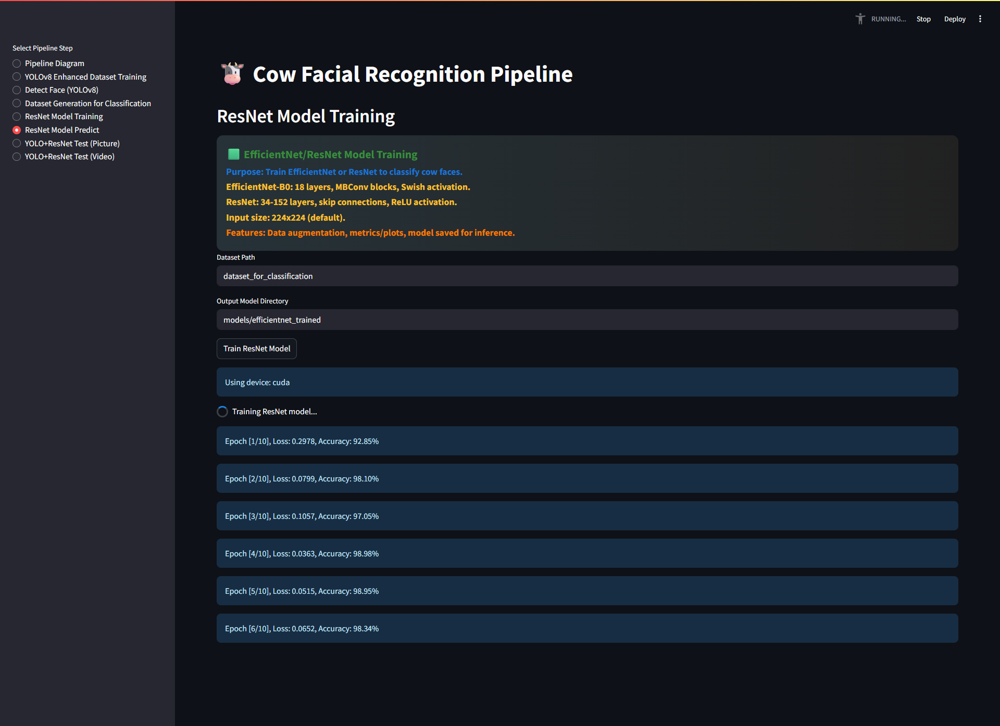

# 🐮 Cow Facial Recognition Pipeline

A modern, research-grade pipeline for cow facial recognition using YOLOv8 for detection and EfficientNet/ResNet for identification. This project is designed for robust, modular experimentation, supervisor-friendly presentation, and easy extension for research or production.

---

## 🚀 Features
- **End-to-End Pipeline:** From raw video/image to annotated results.
- **YOLOv8 Detection:** Real-time cow face detection with technical details exposed.
- **Dataset Generation:** Automated cropping, augmentation, and train/test split.
- **EfficientNet/ResNet Classification:** Flexible backbone, research-friendly metrics, and model saving.
- **Streamlit UI:** Modern, multi-tab interface with technical summaries and beautiful banners.
- **Publication-Ready Diagrams:** High-res, square pipeline flowcharts for research papers.
- **One-Click Setup:** PowerShell script for full environment and dependency installation.

---

## 📂 Project Structure

- `app.py` — Main Streamlit app (all UI/UX, banners, and pipeline logic)
- `part0_detection_Flow_diagram.py` — Pipeline diagram generator (with Streamlit integration)
- `part1_yolov8_enhanced_dataset.py` — YOLOv8 training and dataset enhancement
- `part2_detect_face.py` — YOLOv8 face detection (image/video)
- `part3_yolov8_based_dataset_generation_for_classification.py` — Dataset generation for classification
- `part4_resnet_model_Training.py` — EfficientNet/ResNet model training
- `part5_resnet_model_predict.py` — EfficientNet/ResNet single-image prediction
- `part6_yolo_resnet_testing_picture.py` — Full pipeline (YOLO+ResNet) on images
- `part7_yolo_resnet_testing_video.py` — Full pipeline (YOLO+ResNet) on videos
- `requirements.txt` — All Python dependencies
- `setup.ps1` — One-click setup script (Windows/PowerShell)

---

## 🖥️ Quick Start

1. **Clone the repository:**
   ```powershell
   git clone <your-repo-url>
   cd cow_facial_recognition_yolo_imagenet
   ```
2. **Run the setup script (Windows):**
   ```powershell
   .\setup.ps1
   ```
   - This will create a virtual environment, install all requirements, install Graphviz, and launch the app.

3. **Or install manually:**
   ```powershell
   pip install -r requirements.txt
   # Install Graphviz from https://graphviz.gitlab.io/_pages/Download/Download_windows.html
   streamlit run app.py
   ```

4. **For WSL/Linux:**
   ```bash
   sudo apt update && sudo apt install graphviz
   pip install -r requirements.txt
   streamlit run app.py
   ```

---

## 🧩 Pipeline Overview

1. **Data Loading**
   - Load cow videos/images (1920x1080)
2. **Detection (YOLOv8)**
   - Detect faces (37 layers, 640x640, SiLU activation)
3. **New Data Generation**
   - Crop faces, create train/test dataset per cow
4. **Classification**
   - EfficientNet-B0 (18 layers, Swish) or ResNet (34-152 layers, ReLU)
5. **Output**
   - Annotated image/video with bounding boxes and class labels

See `part0_detection_Flow_diagram.py` for a publication-ready, square pipeline diagram.

---

## 📊 Streamlit Tabs
- **Pipeline Diagram:** Visualizes the full pipeline with technical details
- **YOLOv8 Enhanced Dataset Training:** Train YOLOv8 for cow face detection
- **Detect Face (YOLOv8):** Detect faces in images/videos
- **Dataset Generation for Classification:** Crop faces and auto-generate classification datasets
- **ResNet Model Training:** Train EfficientNet/ResNet for identification
- **ResNet Model Predict:** Predict cow identity from a single image
- **YOLO+ResNet Test (Picture):** Full pipeline on images
- **YOLO+ResNet Test (Video):** Full pipeline on videos

Each tab includes a technical summary, modern info banner, and user-friendly controls.

---

## 📝 Technical Highlights
- **YOLOv8:** CSPDarknet, PANet, SPPF, 3x3/1x1 conv, SiLU activation
- **EfficientNet-B0:** 18 layers, MBConv, Swish activation
- **ResNet:** 34-152 layers, skip connections, ReLU activation
- **Data Augmentation:** Built-in for robust training
- **Metrics & Plots:** Training/validation accuracy, loss, and more
- **Model Saving:** All models saved in organized folders for easy reuse

---

## 📄 For Research & Publication
- Use the pipeline diagram generator for a square, publication-ready PNG
- All technical terms and file mappings are explained in the app and code
- Modular codebase for easy extension and reproducibility

---

## 🤝 Contributing
Pull requests and issues are welcome! Please open an issue for major changes or feature requests.

---

## 📜 License
MIT License (or specify your license here)

---

## 🙏 Acknowledgments
- Ultralytics YOLOv8
- PyTorch, torchvision
- Streamlit
- All contributors and open-source libraries

